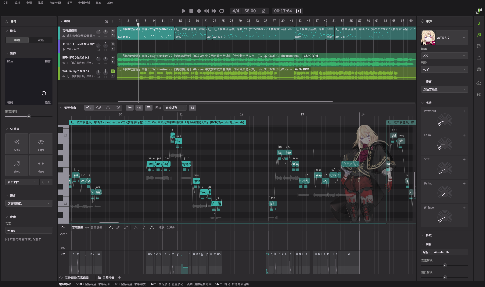

# TGR：调声和鬼畜创作的简单工作流

> SV-TGR: Track&Tick, Grouping, Retakes <mark>（音准卡点-填词-重录三步走）</mark>

<figure style="width:30%; margin: auto;position: relative;">
</figure>

  

TGR工作流表示在 [Synthesizer V Studio Pro](https://dreamtonics.com/voices/) 中，使用三步方法“翻唱”网络歌曲：

1. 【带歌词的midi格式全曲】下载原曲经过人声分轨(Track)，导入SV，点右键自动扒谱（配合TGR重敲小片段-"Retick"）
1. 【“会换气”的乐谱】在SV插件:【TGR WebUI】中修复识别失败的歌词，并依据时间间隔重分音符组 → 为高潮低潮段落，选择独特声线和多轨叠唱！
1. **【确定的乐谱、虚拟歌手、唱法】开始闭眼试听循环：选取瑕疵，Alt+T 重录，直到满意** → 录视频投稿，或向TGR开源svp文件（投合作/等PV师调音师？）

自动扒谱扒不准：可以用多声源（或网易 X Studio-仅中文声源）重扒mid，粘贴正确音符到错误处。

`OpenUTAU>工具>Packages>game` 在音高上比SV还准，扒谱前需在SV检测曲速并在左上角填一下，XS同理，且中文分词比SV准太多。[XS每个网易号1天两次免费，不要浪费~](https://xstudio.music.163.com/#page_two)

**本项目 "Retick" 扒谱只需用到听觉/S键/A键，有点像《别踩白块2》这款游戏，只是这次由您来谱曲：没购置【硬件MIDI键盘】，或是没听过钢琴指法这回事？不影响！**

被AI扒谱的小瑕疵卡住？想随便加点“原创咬字”但节拍感较差？或暂时不想购买SV？免下载的TGR插件比各色扒谱工具更加快捷！

注：AI重录时，建议您使用👆【演绎-钢琴卷帘-声线面板】的左右对称布局，全曲重录满意度有20%时，对关键咬字调整【演绎四宫格】。导出wav前，直接打开内置的【混响】与【立体空间声效(多轨叠唱)】，可以选择跳过混音步骤。

初学TGR时，可跳过【逐句声线】的步骤，开始重录循环前只需为全曲挑选出好的预设。

总之，这就是从原曲走到“翻唱”的一切了！

## 新方法与老方法

> 对于新一代P主们：

TGR三步走的要求集中在【听觉记忆】和【直觉演绎】上：帮助主创在不同的重录之间，记住出彩的音符，并最终学会在整体反复播放之中，把“不太入流”的重录用到位；或是把演绎的四个方向一键猜准，具体数值不用画。

听歌时的方向感，比对数值的微调重要太多。必须承认：鼠标和屏幕，不可能适合用于歌声调教（哪怕是拖动曲线控制点？🧐）

**手绘从来是合成音乐界独创的难题。真正的律动和感情就不是【一条线】，更无法被AI大厂的合成替代。**

至于音感和乐理，TGR项目基本上是为了让完全不懂音乐（但天生就会吹口哨/玩音游/读简谱）的人做翻调的工具。SV 2.2.1 作为【💯发挥潜力的媒介和试错舞台】的性能，目前仍不适合看不懂钢琴键的朋友哦。

有乐感自然专业，但对BPM和节拍不感兴趣的普通发烧友，也可以参与V圈创作！

**_尤其是已经支付小1千买断 SV Studio 和各家虚拟歌姬的爱好者们……_**

我想，这份价格已经充分说明：Disco的世界，不该有第二、第三第四层的“行业门槛”去消磨【普通人】的创作热情。

调音，该看主创的灵感够不够！就像某种用“S一指禅”扒谱精调的、毫不高深的点子：“打点计时器”比五线谱靠谱。（备注：Ctrl+F "吉他/钢琴"，本页有工具推荐）

## 插件功能

所以TGR工具箱，包含两个功能：

Alt+R 重敲所选音符
- 选中或插入空音符组：弹出网页，以左键试音，右键+1条音高，d键删除。把走带拖到原唱开口前几秒，再按 Alt+R，开始为每个音高打轴。
- 一指禅：S键设置右1音符的 on-off timing, A键放置休止符(f0-on-dur timing)，d从头再来。完成后按S重新弹奏，w预览A完工
- 钢琴键总是用于从所选音符开始往后设置音高，w键播放暂停
    - Tips：您可以选择mp3来【免SV使用】Retick功能，完工一键导出 .mid,json （过程中不可退出网页或查看，只能从左向右添加音高组并打轴、拖拽进度条）
    - 👍可以与 OpenUTAU 打配合（截屏导入音高并Retick），解决网易XS扒不准的日文韩文歌曲！ 该功能也可用于与朋友发图分享工程片段，粘贴聆听图片里的旋律

Alt+G 歌词重录模式
- 加速预览性能，规避调参时与手绘曲线（声线/响度/张力/..）战斗！
- 选中1或多个音符组，自动合并到多行编辑，提交按钮自动重新分组，编辑一行歌词，可勾选自动重放。🎯可勾选行首自动br
- 分完组做“瑕疵随心选”：
- 在WebUI打开期间在SV中随处播放，您点选音符的走带位置将在框中标红（记住），您点选的行同样会被SV选中。**🎯随时将标红转为选区-再次点击即清空**。推荐注册 `Alt+左右键` 为快速跳转、`Alt+D/M` 为重置音高和合并音符
    - 闭眼按F键 = 点选走带中的音符！默认勾选：F键暂停（不重置走带）
    - 填词全汉字/全平假名自动免空格分词，自动防歌词溢出（可按行粘贴原词-点击连音或删除），-+'号和br 会跳过显示，方便音高的自由修饰。.号音素暂不可编辑，由"*"占位。
    - 👍这一套下来，可将AI扒谱过度切分的歌词一键填完'-'，省心了！
- 可勾选：🎯此音符组的声线雷达图（编辑自动重放）、点选时自动扩展选区到左右br或sil，方便按句子调整演绎四宫格

Alt+T 重录（SV独家的AI功能）
- <mark>👍【即时试听模式】音素面板的标题栏 右键双击开启</mark>
    - 播放中右键拖动走带（按住Shift+右键才是菜单），中键滚动音素响度，双击进入音高控制点模式。SV-TGR 编辑进化，一个不落
    - [12qw] 快捷重录，Shift+2=重录并只保留旧音素，音质更清爽。 Shift+1=拉开重录菜单
- 👍强制单轨多歌手：模板svp含 "音符组视图"蓝绿轨 请右击音符组设置歌声 + "♯  请在下方选择默认声库"紫轨 +深绿BPM+浅绿VOC 。Alt+G 将强制音轨[0]所有音符组首尾不叠
- 自动高亮走带中的音符组！ 重启电脑后可能不响应，点开一次.opu文件即可

**先确立音高f0，听着原曲卡点过t0t1，最后才是填词L+音素ae（吐字与演绎的精调）。左右横跳式的输入卡点和音高？同时弹和唱？那不符合人体工学。**

次要功能
- 【歌词】面板，无需选中音符，速改单行歌词
- 【齐唱】面板，为选中音符组创建2~3个音高/时间有偏移的链接（下方或新加名为"H1~3"的轨道）
- 👍【翻唱对照模式】，"V-1", "V-2" 轨道在切换时，自动静音旧轨道。Alt+Del 转而删除第一轨道对应选择区间的音符
- 【自然段对照播放】菜单，支持添加 "BPM-" "VOC-" 开头的两个采样轨，以音符组为单位，交替播放原和声/翻唱和声（切换 双Solo vs Voc Mute），方便调声晒
- 调试细节
    - 右上角，可勾选音色三角波（或吉他/WebMIDI合成器）、自动 sil2line 组内插入呼吸（的断句阈值）、sil2dots (..|。。) 自然段所需的毫秒
    - UI页可按键 "[]{}" 增减任何音符属性(t0,f0,dur..)
    - 可开启 `"lyric.Cs1=C♯1, la.A4=69 .."` 音高转文本编辑，可复制尖括号lrc。json序列整体例如 `[走带索引=0, "音符数=2 文件名", dt,"一.24", dt1,休止符="", dt2,"闪.69"..]`

- Credit:
    - [MCP接口列表（可供开发者参考或试玩） by MetaMikuAI](https://github.com/MetaMikuAI/SynthV-MCP/blob/main/README.zh-CN.md)
    - [SV2实用脚本集合：和声面板、超级手动音高 by 霧雨ResonantPsyche](http://b23.tv/BV1U9Km6AEzo)
    - [SV1/SV2脚本仓库 by 尊贵的阿昆达](https://space.bilibili.com/12131593/lists/2087283)

👍、🎯 标注的部分对于提升效率至关重要。

做歌不是编辑Excel，合成器是乐感的媒介，不能喧宾夺主。RIFF机/琶音器/节拍器就是这个道理，Sequencer（一小行方格）都能抓住90%歌曲的灵魂，卡农和弦同样极短。做音乐从原理上讲不应该复杂，律动和编辑都会很顺畅。

您可以随时在 `SV>脚本>TGR>` 查看此手册。

---

建议试用：Ctrl+Shift只拖动音高/Ctrl+Alt横向精调、【音素时值】的尖坡型为辅音（可用于拉高音量）、演绎四宫格的【机械】为手动参数-可以与AI音高混合

建议试用：链接音符组取代参数同步模式、 `[', -, br] 中日文填词，[+] 切分英文单词`、[免安装MIDI编辑器](https://signalmidi.app/edit)、[免安装跨引擎转换](https://soulmelody.github.io/libresvip-pwa/)

推荐安装：🧐 ASIO4ALL 176k超清音质、UVR5+ytdlp+一键转svp脚本、DiffSinger “声线的自由”

该svp脚本有在文件窗口中F2键【转换/从BV号和mp3新建/保存】翻调项目的三大功能，非常直观，最适合多引擎调教师，见下章。

代码调试的特有功能：

- 👍插件页F12可启动SV，通过剪贴板监听+eval实现补齐和对象log等，<mark>可视化和改写所选音符的JSON属性</mark>
    - 可用于管理js脚本文件，社区贡献随本项目打包。
    - 🎯可作为脚本模板 `#include "SV.js"`，新建插件或与H5绑定均可。
    - `var svp; if(svp = SV.getHostInfo().chrome) alert(svp.fileName, svp.ui.currentTrack, svp.ui.player, svp.arr.sel)`
- 【搜索并选中】菜单，默认搜 "$0.lyrics==it" 并全选
- Alt+G 后每次onfocus都请求json序列的更新，提交重新分组后，自动选中所得分组供下次编辑。⚠在有手动音高之后不可重新分组。歌词窗口按w可播放
- S/A键的实现：
    - `i=-1,N=n(音符组), note[i]` 指向应设置t0的词条，同时结束上一条(t1)。播放t0时的音高。
    - A键只结束t1，音高y=0
    - i=-1或i=N时只重置tNow（走带头）到Alt+R时 并切换tRate^=1，i=0 不结束t1，i=N相当于A键
- 👍.opu 无损压缩：
    - 整体解码Brotli
    - 从归一化 CBOR.me 格式判定扩展名
    - V8 Shapes/slots 思路。cbor-x Packr，`{useRecords, structures: svp等预训练结构体字典}`
    - 差分编码，如 [1 2 4]->[1 1 2] 反向还原
        - 还原 xs,ys 数组(i32,f32)=`svp.points.奇偶 or ustx.curves or vpr.controllers`
    - 参考：<https://pypi.org/project/dvfile/> （各种SVS的音符最底线的参数集）
- 点赞截图识别
    - `Tesseract.createWorker('eng')` 对含点赞和描述的最小矩形匹配 opUtau# 以及数字。最左上有数字=B站，否则看最右上
    - 往左截取200px，有5x5的 #00aeec, #f1f1f1 即可。[operator="erode"] 识别有可能错，用户做一次3个十位数的加法也算通过。
    - [验证界面Demo](https://codepen.io/duangsuz/full/WbRypXO)

以上，为TGR软件设计的【离线可用部分】。致敬：[2020年的Hachiko.pygame项目](https://pypi.org/project/hachiko-bapu/)

## 向OpUTAU贡献工程源文件的好处

总的来说，我们期待此企划实现以后，**翻调 / 鬼畜 / 原创者找灵感 / 发烧友听新歌 / V圈二创和联动**/炼丹圈训模型的创作体验，像“每天走去音像店买光碟” 的人穿越到 “村通网了！” 那样幸福。

我们希望：OpUtau 支持的F2脚本/TGR插件，有机会像 MMD/Live2D/VRChat，甚至是OBS那样，成为一种必备的工具。得益于曲谱数据的流量极小以及“开源云盘”与CF的闲时计算，免费性可持续。

> 注：下文的“BV号”均指代 `BV号/yt/sm号`，即 B站、YouTu.be、Nicovideo.jp 的视频链接均有支持

> 无需账号或客户端！

- 将svp/ustx/vpr拖入网页，自动转换srt和mid供您和所有人下载，并提供 `opUtau#番号` 填入视频简介或存进笔记软件。
    - 可在浏览器中列举、更新工程的BV号稿件预览，或批量删除。粘贴番号一键下载svp（可设置任何被 [UtaFormatix3](https://sdercolin.github.io/utaformatix3/) 兼容的文件格式）
    - 可导入导出番号列表.json，用户主权！
    - Discord+TG群机器人公告引流（默认匿名，设置BV号时可开启推送）
- **🎯可要求下载者上传特定BV投币点赞的截图，以获取链接**
    - 可要求标注来源、申请二创、仅供学习（CC-BY-NC 等许可证）
    - _商业相关请您转向 vsqx.top, BowlRoll.net, Patreon_
    - 👍 DC群友(@duangsuse, 插件作者) 承诺为>3分钟，且投币数 < 3 的B站稿件投入2硬币，不分制作质量。如果当天没有币就评论鼓励。 （在TGR项目的维护期间）（上次更新：2026年度）
- **🎯svp分享可用于匹配队友，合作创作哦！**
    - 上传并下拉选择意向声库/引擎。上传过相关文件格式以及声库的下载者，会看到您的联系方式弹框，并在广场（`SV>脚本>TGR>` 菜单中可访问）展示10天或直到重新设置 `colab:no`
- 超级懂歌
    - 使用E站的标签系统！所有标签示例 `ti:曲名 c:洛天依 p:ilem sp:alan-walker vp:Dreamtonics vp:Bilibili a:虚拟歌手祭 a:冰雪奇缘 vp:Pixar y:2013 co:青溯 l:粤语 l:ja chorus:at50`，标签域 co,l,bpm,chorus 可自动提取
    - `g:orig原创曲 g:殿堂曲 g:梗曲 up:BV17p421978D g:glitch g:choir cc:BY-NC-SA pv:vfx pv:story pv:cut pv:no`，比如曲名=《初音未来的消失》《ECHO》《求与影》 g:glitch，《群青》 g:choir pv:story pv:vfx（整个视频有单一故事），《Bad Apple》《乐意效劳》 pv:other
    - 支持粘贴1~3张视频截图作为封面

⚠ 为了歌曲集的存储优化和调教质量，V圈五大家 (V/SV/CeV/UTAU/ACE, DV平替CeV, XS平替ACE)

我们只支持上传三类文件格式😓。

其他引擎和旧工程可转换 `.ccs/.svip3->svp  .ust->ustx  .vsqx/.dv->vpr`，用脚本转换并检查后上传！

`.acep -> mid导入svp重调`，因为 ACE Studio 加密了项目文件（手调的参数不可迁移到别家），甚至有禁用MIDI导出的前科，[不可排除只因填词被封号/断供锁项目的风险哦。](https://openvpi.github.io/market/plugin-ace.html#:~:text=1.1.0%20版本强制更新)

不说某短视频厂商的事了。

> 完成度极高的离线曲库预览！

- <https://openvpi.github.io/oputau> 曲库WebUI
    - 🎯快速聆听上传者上传时走带头的位置（副歌部分），预览其音高线（嘟嘟嘟，在TG上也能听）
    - 🎯WebSV免安装歌曲查看（注：仅日语。本项目与D社官方并无关系）
- GitHub开源svp仓库（可搜索lrc）
    - 双首字母排名，如 `"Let it Go"->/svp/l/i/Let-it-Go/m.svp.opu, "牵丝戏"->/ustx/Q/S/牵丝戏/m.ustx.opu, "千本桜"->/vpr/-SE/-N/千本桜/m.{vpr.opu,lrc,tag}`
    - 曲名仅可包含中英日韩字符、0-9、横杠，歌词搜索可以搜法/意/西语。支持拼音/罗马音匹配
- MIDI合成器 [ChipTune.app](https://chiptune.app/browse/Demo%20MIDI/Voyetra%20Orchestrator) 可播放（红白机怀旧、高保真钢琴音色）
- 🌻让D社的7天试用变的极其值得用！

WebUI还将克隆svp仓库，并保持同步：
  - 完整工程会被无损压缩，[上传任意svp到这里](https://json-space-analyzer.com/)就知道是什么让轻巧的mid膨胀到2MB了。
  - 整曲实际占用<100KB/1首歌（以SV中文demo曲为例），百首SV只需10M！不怕群P上传和试听~
  - 混音器和混响，SV声线、重录和演绎参数【总是】受到支持。 [LibreSVIP列举了各种怀旧的引擎格式](https://soulmelody.github.io/LibreSVIP/project_formats/)

## OpUTAU相关软件的安装

> 下文带🎁的软件为免费开源，初次运行前安装好它们以实现特定转换功能！

⚠ 注意
- _不支持上传伴奏！！若伴奏来源于BV号，TGR插件自带有【F2脚本一键翻调或转码】_
    - 右键+W，`新建 > OpUTAU BVsong Downloader` 并输入 `"一生之幸-BV17p421978D"` 或 `"QingSu的小曲-SjmMu_CTdFY"` 打开即分离人声（可继续粘贴第三列-只含伴奏的BV号）
    - 👍 复制任何mp3链接（如 <https://www.myfreemp3.com.cn/?page=audioPage&type=netease&name=> 曲库）后，右键+W 只输入曲名也可以
    - 👍 Win+E `顶栏>查看>显示文件扩展名`，选中任何项目文件或m4a，F2移到最右追加".opu"。改名再打开，自动分轨另存为svp文件！下载缓存文件夹名为链接名后7字
    - 同理可转码 `"任意文件.mp4.m4a.opu"` 等等。工程互转时，自动把SV的br，ustx不识别的汉字假名转换好
    - [🎁 LibreSVIP.exe](https://github.com/SoulMelody/LibreSVIP/releases)
    - [🎁 点此安装1.6G的UVR人声分离器](https://github.com/Anjok07/ultimatevocalremovergui/releases/tag/v5.6)：16G配置的电脑大概是“1.5x倍速播放”吧。MDX最快，VRA质量合适，Demucs对合声支持更好
    - Demucs 可对吉他/钢琴单独提取，[配合这个扒谱！](https://basicpitch.spotify.com/)

题外话：
- [用到自动装【Upscayl阿普升图】](https://github.com/xinntao/Real-ESRGAN/blob/master/README_CN.md#便携版绿色版可执行文件)，F2重命名 "实拍.webp.2x.opu" 或 "动漫.png.2X.opu" -> 动漫_2X.webp [（另有Pocast音质超清工具）](https://podcast.adobe.com/en/enhance)
- [图片背景分离器](https://github.com/nadermx/backgroundremover)，Ctrl+左键多选几张图片，复制，右键新建 `"-remBg.fg.opu"` 打开即可。[（有OBS版本）](https://github.com/royshil/obs-backgroundremoval/releases)
- 🌻-remBg 将生成相关文件夹，而 `Win + Shift + S` 后右键新建 `"-hero.png.fg.opu"` 则把剪贴板单张截图转写为 hero.png。【批量扒谱】则创建一堆无后缀的 曲名-BV，新建 "-ilem.opu"，都相当于拼接文件名
- [🎁 remBg模块依赖Py环境，为可选安装！](https://apps.microsoft.com/detail/9pnrbtzxmb4z)N卡比较好的朋友[可以自制4k视频](https://github.com/AaronFeng753/Waifu2x-Extension-GUI#samples)观看，[🎵4k120fps预览PV](https://www.bilibili.com/video/BV1C1RABDEMp)，不再赘述~

🎁 F2脚本安装方法：`SV>脚本>打开脚本文件夹`
  - 请将zip解压到【存放svp的目录】，授权运行 `sv-F2.py.bat` 即可！它产生下载缓存如 `./oputau/m/BV17p421978D/{m,m_bpm,m_voc}.flac`，创建+运行 `uninstall.opu` 只删除菜单项
    - 🎁 [AHK](https://www.autohotkey.com/download/) 以及 <https://github.com/mhogomchungu/media-downloader>，打开一次等它文本框滚动完。
    - 🍻 国内下载慢[都用ghproxy加速](https://github.akams.cn/)，如果ytdl用不了了，试试OBS录屏+F2转m4a+F2分轨svp吧……
  - 安装目录 sv-F2.ini 🌻可编辑您热爱的引擎名(E=svp,ust..)，UVR计算质量=1~3、ydtl预设序号、m4a=320k/flac无损、crf=视频质量
  - 🌻【方便调声晒】一般 `trip.A.B.opu` 在 `PC/libresvip/plugins/*` 没有列出A时，会用ffmpeg自由转码，但在A-B为mp3-mp4时，就会替换视频轨为同目录 trip.mkv 录屏

技术细节

- 【曲库WebUI下载项】一键转换至常用引擎（自动移入svp目录）打开，后台将伴奏补完重建后，会弹框确认在 `SV>文件>打开最近文件` 中自动重载和识别（仅限 E=svp）。 a.mp3.opu 可一键走到此步（四轨模板 sv-F2.svp ）
- 分离完成后，默认搜索myfreemp3歌词，可在ini中删除 （不含 .mp3.opu）
    - 👍【干声可处理第二遍】如果AI扒谱（尤其是扒音高线时）跑调严重，强烈建议 `UVR>🔧>Download Center>VR Arch>` 下载DeEcho-DeReverb并在🔧上的框中选中，跑第二遍。

> OpenVPI 社区挂机互助组！

暂时不想安装创作工具？

上传1个原曲不重复的svp，即得 `@闲_态度/Vocal2Midi` 的1次调用机会（<240s的BV视频，公共算力池，群友的PC从 CF Serverless “抢单”。若本机安装GUI则需下载5G模型权重）

同原理：有不定期的免费小量机器代扒谱（SV或ACE付费版）服务队列。

您可以 [在DC群](https://discord.gg/wwbu2JUMjj)>SHARE>opu-files 收到视频号完成的纯文字通知+无参.mid链接。传输中的压制，会影响伴奏音质和调教手感，所以只有mid供您导入

注：Vocal2Midi 可输入手工歌词辅助识别，使用 RMVPE/GAME+LyricFA 算法提取音高线、切分音符、识别吐字。RVC的一键包可以试试 SDIJF1521/xb-svcb 但AI翻唱坑也很多。

**🍻 感谢VPI社区辅助开发。更多调声相关的开源技术请访问 <https://diffsinger.com/>**
